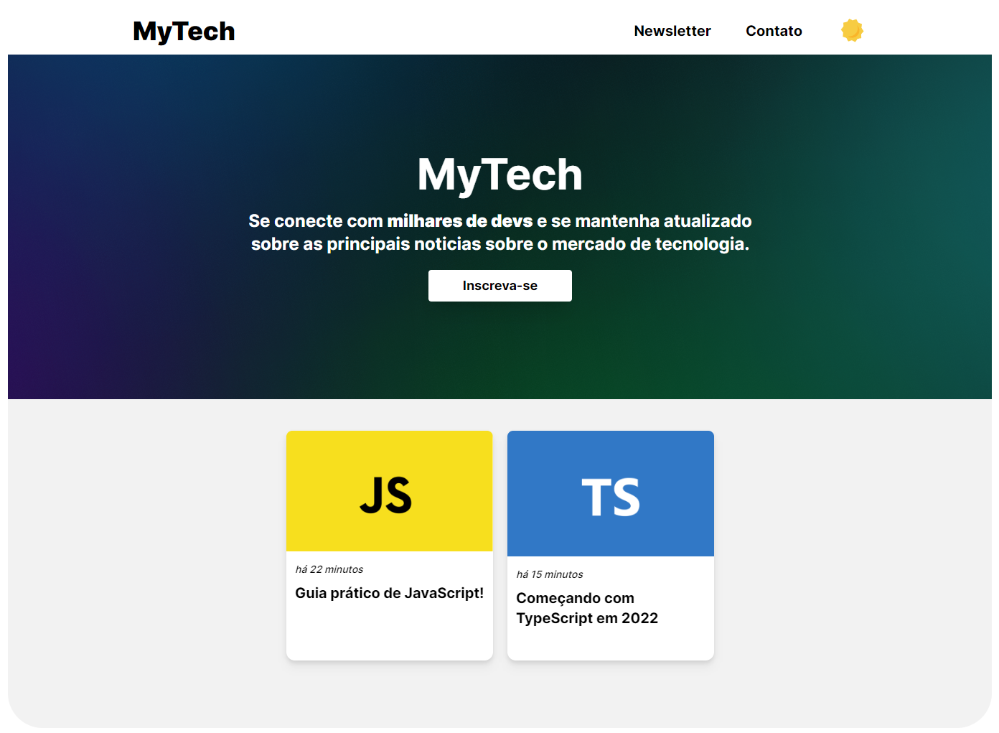

<div id="top"></div>

<br />

<h3 align="center">MyTech Blog</h3>

  <p align="center">
    A Blog made for study purposes

</div>
<br />
<br />



### Built With

* [Next.js](https://nextjs.org/)
* [Graphcms](https://hygraph.com/)
* [GraphQL](https://graphql.org/)
* [Tailwindcss](https://tailwindcss.com/)

<!-- GETTING STARTED -->
## Getting Started

**1- Clone this repository:**
```bash
https://github.com/luizfranzon/twitter-video-downloader && twitter-video-downloader/App
```
**2- Install dependencies:**
```bash
npm install
```

**3- Run dev server:**
```bash
npm run dev
```

<p align="right">(<a href="#top">back to top</a>)</p>
